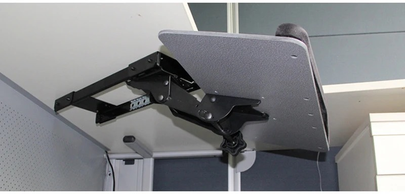
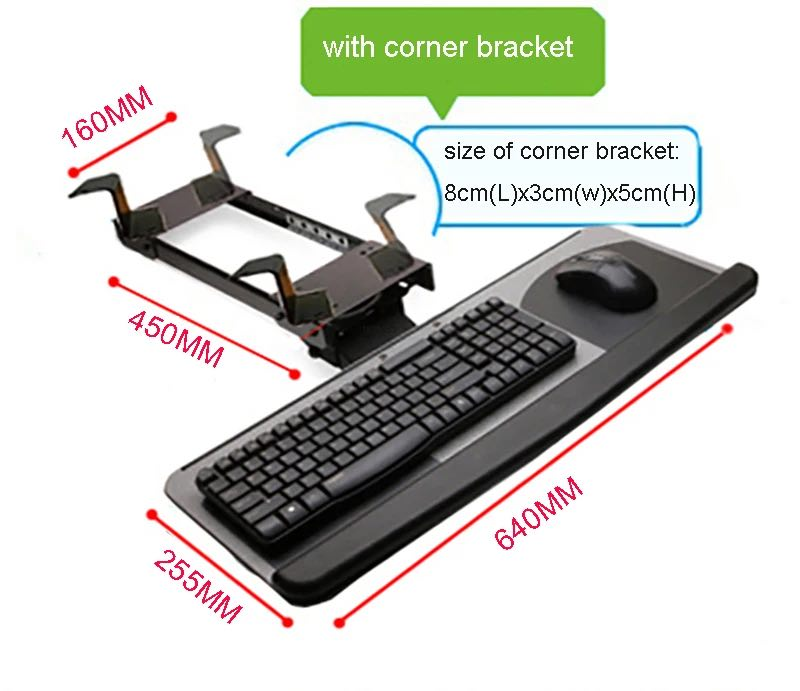

# Custom Tray for the LK06AD Keyboard Tray 

> [!WARNING]  
> The default settings will result in a tray that is different from the original. I customised the dimensions and layout to suit my personal needs. For instance, the tray is mounted off-center on purpose, so that I have more space for my mouse on the right side.
> 
> The OpenScad model is parametrised, and it's up to you to set the desired parameters (e.g. tray width) according to your needs.

## Context

I purchased a LK06AD Keyboard Tray (available on AliExpress under different names), which looks like this:

The mechanism is very good, but the tray (the "wooden plank") was not ideal for my setup. For one, I have a very wide keyboard, and there was not enough space for my mouse on the right side. 

Luckily, the tray is literally just a wooden plank with 4 mounting holes, and can easily be replaced. 

This repository provides an OpenSCAD model for a custom plank. The model is fully parametrised, meaning that you can simply change some settings (e.g. tray width or screw positions) to create your own. You can then use OpenSCAD to export the model to a file format that can be used with laser cutters or CNC routers to cut your tray.

## How To Use

Open `main.scad` in [OpenSCAD](https://openscad.org/) and adjust the parameters at the top of the file. 

When satisfied with the result, export to DXF or SVG, and get it lasercut from a material of your choice. The original tray is about 6.5mm thick. Depending on the material, you might want glue multiple layers together to prevent flexing.

## Result

TODO
